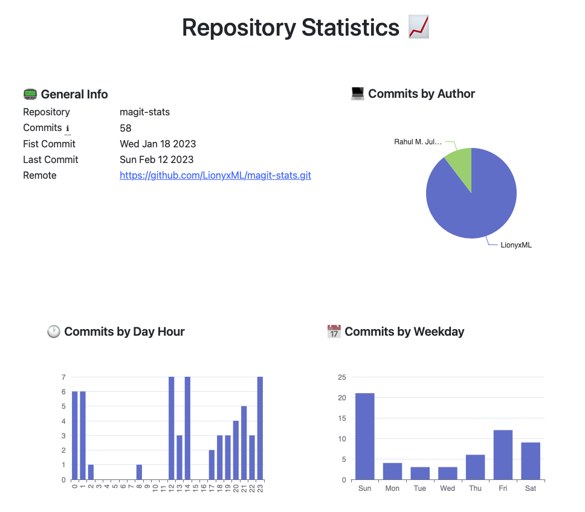
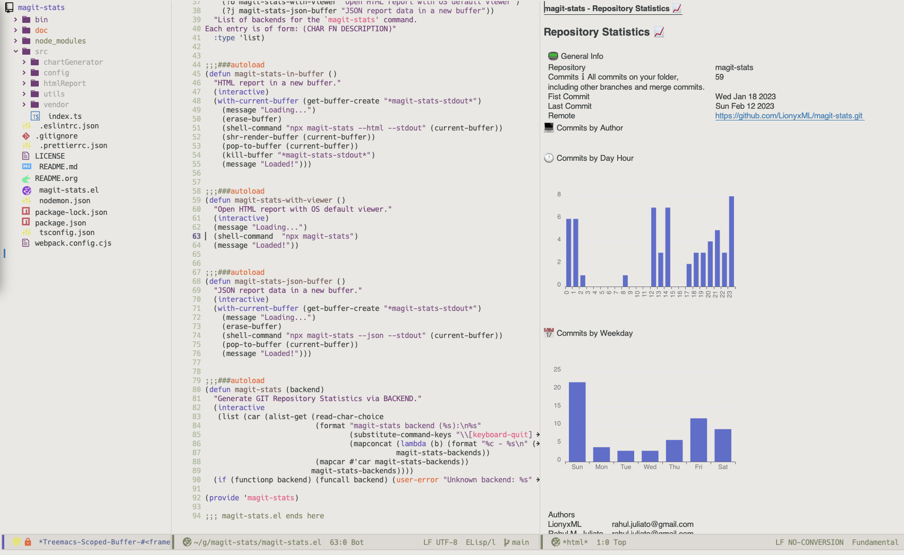

# magit-stats

## What is this package?

A git statistics report generator that can be use as an individual CLI
Tool or called from inside Emacs.

    IMPORTANT: this is a node npx package, if you wan't to use it from inside EMACS
    scroll to the "Emacs Usage" section bellow.

Here's a demo of the report:

## Requirements

You need to have `node@latest` installed in your system and the `npx` tool.

Just check if you have it issuing the command: `npx --version`.

## Basic Usage

Navigate to your git folder and issue:

    npx magit-stats

And that's it! A new `git-stats.html` file is generated with your
repository statistics and will be automatically opened.

## Advanced Usage

You can get all options of this cli tool by issuing `npx magit-stats --help`.

    [magit-stats] - Your git repository statistics
    
    Usage: npx magit-stats  [options]
    
    Opções:
          --html      Saves report to HTML file (default: git-stats.html)  [boolean]
          --json      Saves report to JSON file (default: git-stats.json)  [boolean]
          --stdout    Outputs to stdout                                    [boolean]
          --minify    Minifies the JSON output                             [boolean]
          --file      Output file name                                      [string]
          --repo      Repository name to show on report                     [string]
          --no-open   Does not auto-open the generate HTML file            [boolean]
          --no-icons  Does not use icons on HTML                           [boolean]
          --heap      Node memory heap size                 [string] [default: 4096]
      -h, --help      Show help                                            [boolean]
      -v, --version   Show app version                                     [boolean]
    
    Examples:
      npx magit-stats                          saves report to git-stats.html an ope
                                               ns the file with default app
      npx magit-stats  --html                  same as above
      npx magit-stats  --html --file out.html  saves report to out.html and open it
      npx magit-stats  --html --no-open        saves report to git-stats.html
      npx magit-stats  --json                  saves report to git-stats.json
      npx magit-stats  --json --file out.json  saves report to out.json
      npx magit-stats  --json --stdout         prints JSON report to stdout

## Emacs Usage

`NOTE: NOT YET AVAILABLE FROM MELPA`
Install it from [MELPA](<https://melpa.org/#/magit-stats>) and add to your \`.emacs\` file:

    (require 'magit-stats)

Then open a file that is inside a git repository and call `magit-stats`, like `M-x magit-stats RET`.

Choose an option generate your report!

Demo:

1.  TODOs <code>[79%]</code>

    -   [X] Define git command to output log
    
    -   [X] Detects if it is in a git folder
    
    -   [X] Uses JSON parser to ensure valid JSONs are created
    
    -   [X] Calculate total commits
    
    -   [X] Calculate commits by author
    
    -   [X] Calculate commits by week day
    
    -   [X] Calculate commits per day hour
    
    -   [ ] Calculate repository size
    
    -   [X] Calculate initial commit date
    
    -   [X] Calculate last commit date
    
    -   [X] Change project language to Typescript
    
    -   [X] Configure build scripts and bin
    
    -   [X] Configure npm registry and npx
    
    -   [ ] Compose time series of commits by user
    
    -   [X] Make basic CLI
    
    -   [X] Make more robust CLI
    
    -   [X] Create exporter to JSON on stdout
    
    -   [X] Create exporter to JSON file
    
    -   [X] Create basic exporter do HTML
    
    -   [ ] Add minified option to HTML
    
    -   [X] Fix locale translation for -h and -v options on &#x2013;help
    
    -   [X] Add chart of commitsByWeekDay and commitsByAuthor to HTML
    
    -   [ ] Add series chart to HTML
    
    -   [X] Work on UI/UX on HTML
    
    -   [ ] Create exporter to org file
    
    -   [ ] Create exporter to md file
    
    -   [X] Make elisp package that calls the node function
    
    -   [X] Adds repository name or dirname
    
    -   [X] Choose if you want utf-8 icons ir not

